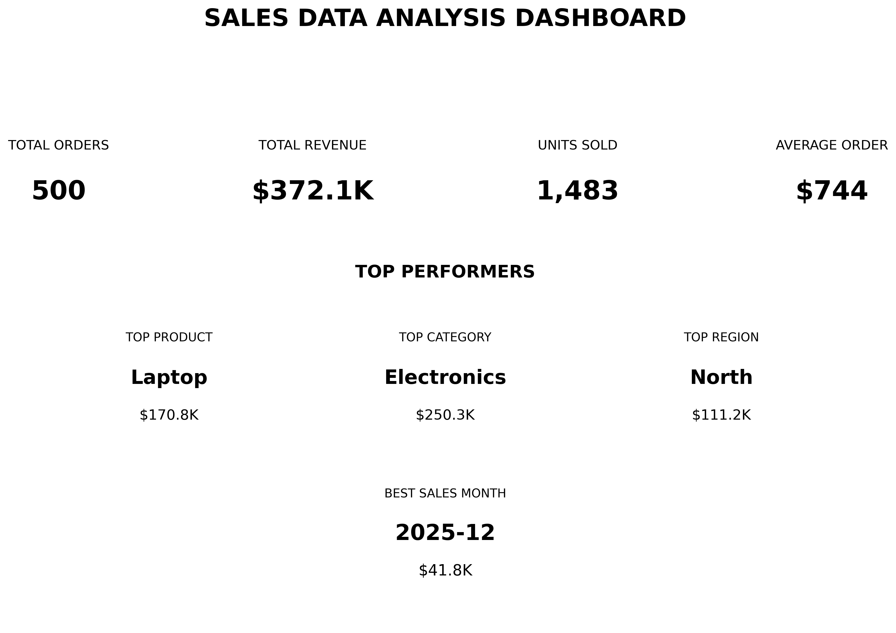
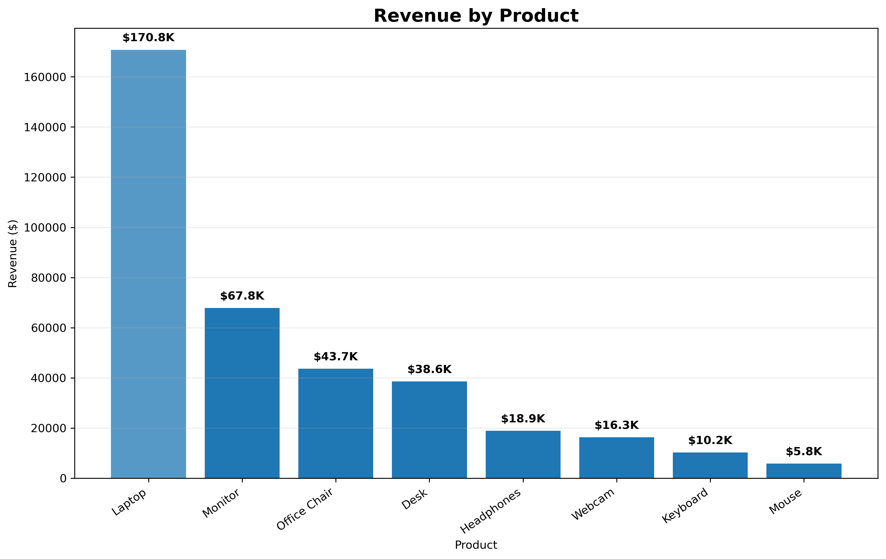
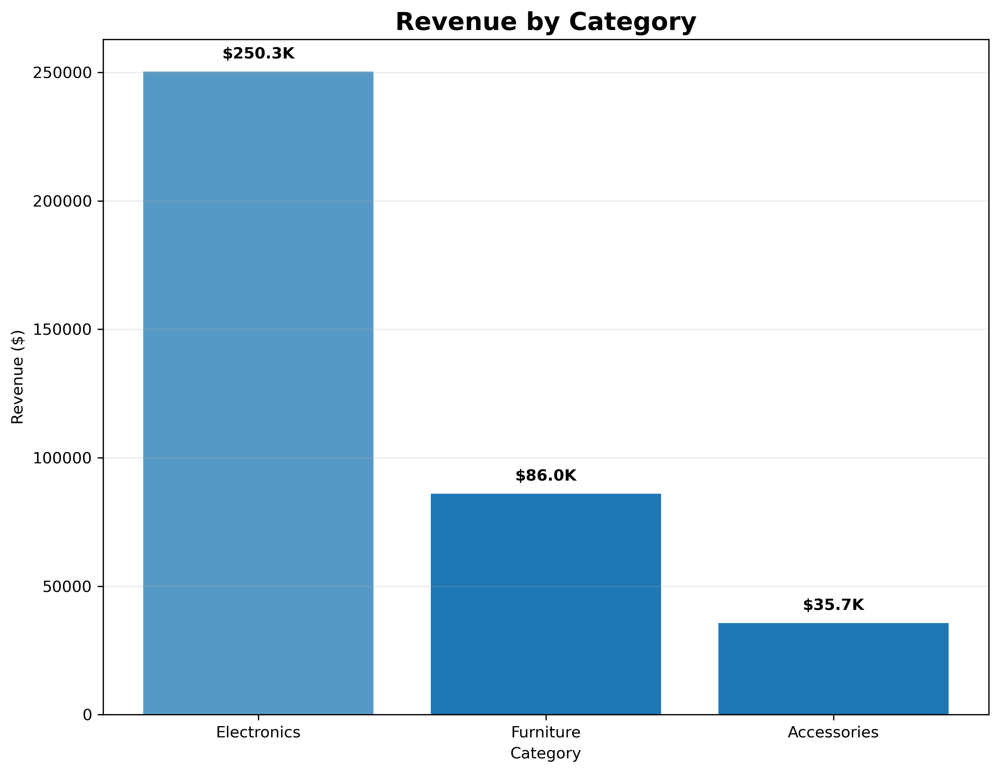
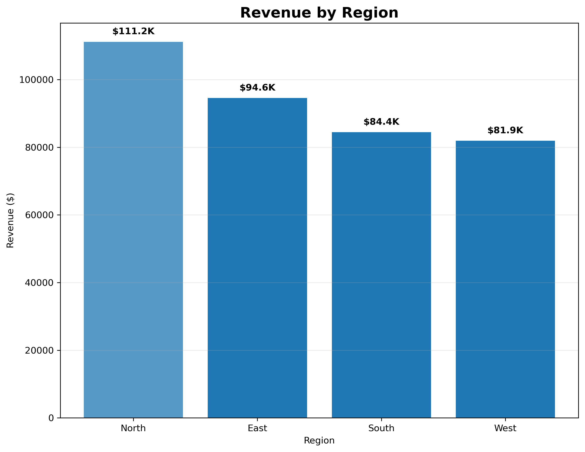
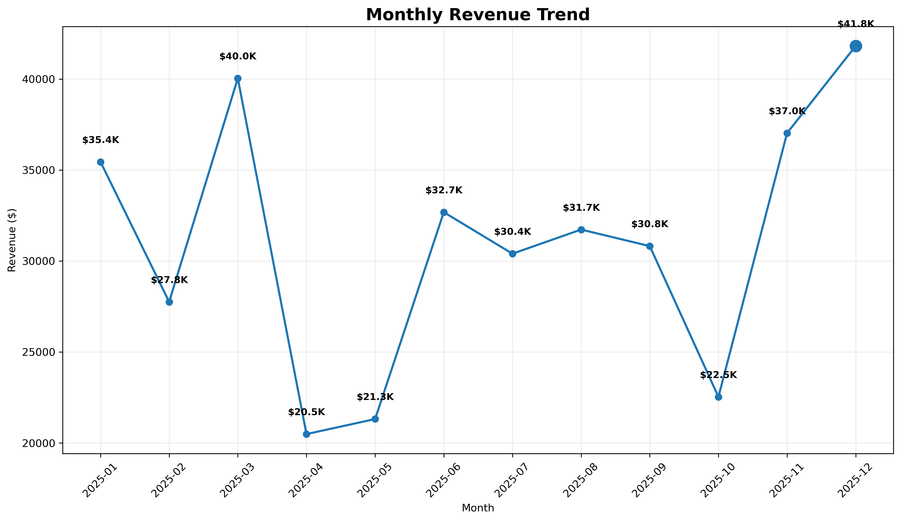

# Python Sales Data Analysis

## Project Overview

This project analyzes a sales dataset using Python to clean, transform, analyze and visualize business data.

The objective is to identify sales trends, top-performing products, categories and regions, and provide useful insights through data analysis and visualization.

## Objectives

- Clean and prepare raw sales data
- Handle missing values and duplicated records
- Standardize categorical data
- Calculate key sales metrics
- Analyze revenue by product, category and region
- Analyze monthly revenue trends
- Create clear business visualizations
- Build a sales analysis dashboard

## Technologies Used

- Python
- Pandas
- NumPy
- Matplotlib

## Dataset

The dataset contains 500 sales transactions with information including:

- Order ID
- Order Date
- Customer ID
- Product
- Category
- Region
- Quantity
- Unit Price
- Revenue
- Payment Method

## Data Cleaning

The raw dataset contained missing values and duplicated records.

The cleaning process included:

- Detecting missing values
- Removing duplicate records
- Standardizing category values
- Handling missing unit prices
- Converting dates into a suitable format
- Validating the final dataset

After cleaning, the dataset contains:

- **500 sales records**
- **10 columns**
- **0 duplicated rows**
- Cleaned and standardized categorical data

## Key Results

### Overall Performance

| Metric | Result |
|---|---:|
| Total Orders | 500 |
| Units Sold | 1,483 |
| Total Revenue | $372,068.96 |
| Average Order Value | $744.14 |

### Top Performers

| Analysis | Best Result | Revenue |
|---|---|---:|
| Top Product | Laptop | $170,797.21 |
| Top Category | Electronics | $250,344.68 |
| Top Region | North | $111,171.44 |
| Best Sales Month | 2025-12 | $41,800+ |

## Visualizations

### Sales Dashboard



### Revenue by Product



### Revenue by Category



### Revenue by Region



### Monthly Revenue



## Project Structure

```text
python-sales-data-analysis/
│
├── project_1_data_analysis.py
├── raw_sales_data.csv
├── clean_sales_data.csv
├── sales_dashboard.png
├── monthly_revenue.png
├── revenue_by_region.png
├── revenue_by_category.png
├── revenue_by_product.png
└── README.md
